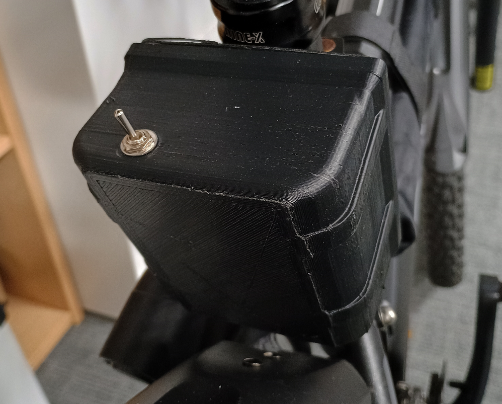
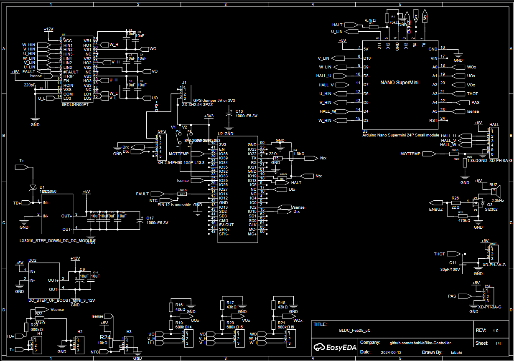
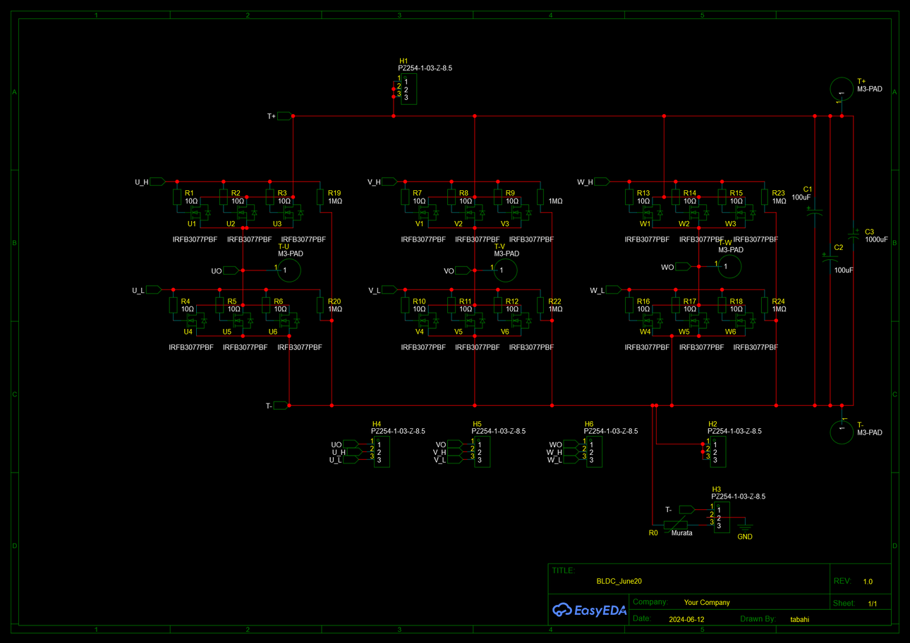
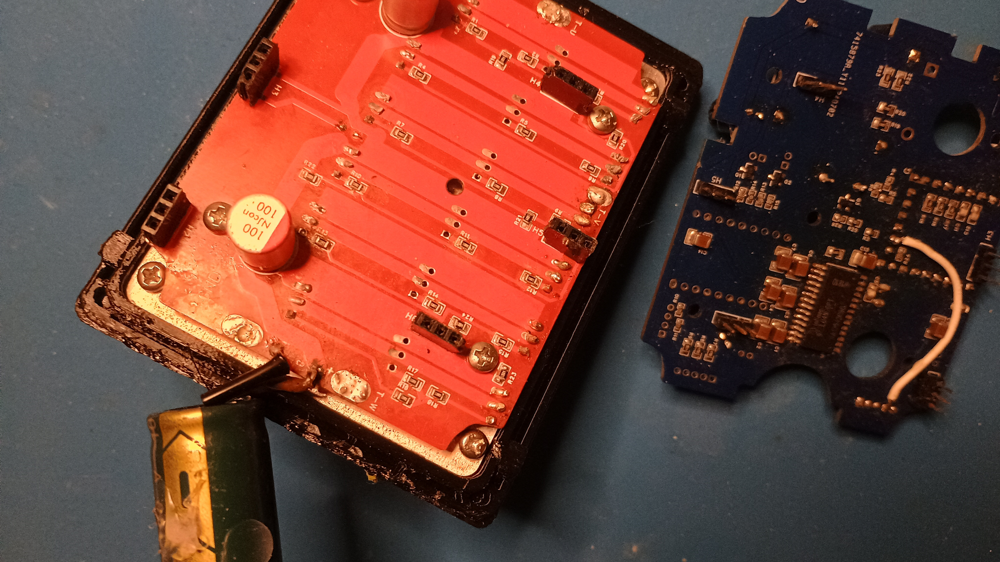
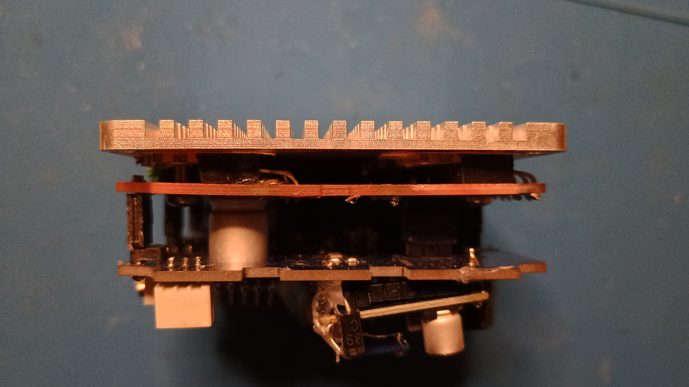
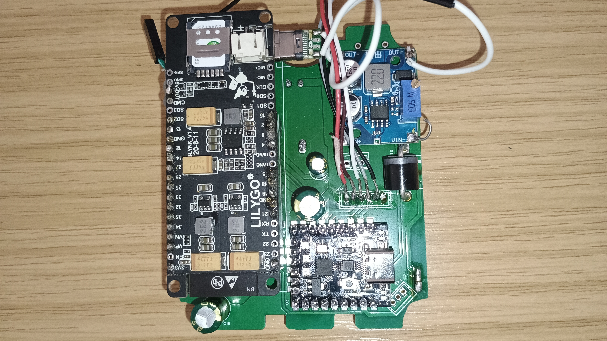

# eBike BLDC Motor Controller

A DIY electric bike motor controller with comprehensive hardware validation, safety features, and diagnostic capabilities. This project includes both simple test code for getting started and full-featured firmware for production use.




## 🎯 Features

### Motor Control
- **6-step trapezoidal commutation** based on hall sensor feedback
- **PWM speed control** with configurable frequencies (3.9-7.8 kHz)
- **Smooth acceleration ramping** for comfortable riding
- **Shoot-through protection** to prevent MOSFET damage

### Safety & Protection
- **Comprehensive startup diagnostics**
  - MOSFET functionality testing
  - Hall sensor validation
  - Voltage level verification
  - Current sensing validation
- **Runtime protection**
  - Overcurrent detection and shutdown
  - Battery undervoltage monitoring with audio warnings
  - Invalid hall state detection
  - Emergency halt signal support
- **Idle power management** with automatic sleep modes

### User Interface
- **Throttle input** with analog potentiometer support
- **Audio feedback** via buzzer
  - Battery level warnings (4-stage progressive alerts)
  - Error notifications with unique patterns
  - Startup confirmation
- **Pedal Assist Sensor (PAS)** support (reserved)

### Diagnostics
- **Serial debugging** at 115200 baud
- **Real-time telemetry** (voltage, current, hall states)
- **Comprehensive error codes**
- **Temperature sensing** support (NTC thermistor)

## 📁 Project Structure

```
eBike-Controller/
├── code_BLDC_simple/          # Simple getting-started code
│   ├── code_BLDC_simple.ino   # Main test program
│   └── tests.ino              # Hall sensor & MOSFET tests
│
├── code_nano_main/            # Full-featured production firmware
│   ├── code_nano_main.ino     # Main program & control loop
│   ├── motor.ino              # Commutation logic
│   ├── thot.ino               # Throttle processing
│   ├── io.ino                 # Hall sensors, buzzer, temp
│   ├── checks.ino             # System diagnostics
│   └── dummy.ino              # Debug/test functions
│
├── PCB_files/                 # PCB design files (hardware)
├── ProteusSimulations/        # Circuit simulations
└── README.md                  # This file
```


- [Schematics and PCB - Top uC Board](https://oshwlab.com/tabahi/bldc_feb25_uc)
- [Schematics and PCB - Bottom MOSFETs Board](https://oshwlab.com/tabahi/bldc_june20)

## 🔧 Hardware Requirements

### Microcontroller
- **Arduino Nano** or compatible ATmega328P board
- Recommended: Nano SuperMini Type-C with CH340 USB chip

### Motor & Sensors
- **BLDC Motor** with hall effect sensors (3-phase)
- Hall sensors must provide valid 6-state sequence

### Power Stage
- **3-phase MOSFET bridge** (6 MOSFETs: 3 high-side, 3 low-side) - IRF3077 or similar.
- **Gate drivers** compatible with 3.3V/5V logic [6EDL04N06PT](https://www.infineon.com/part/6EDL04N06PT)
- **Operating voltage**: 12-72V DC (configurable)

### Inputs/Outputs
- **Throttle**: Analog potentiometer (0.18-0.85V / 180-850 ADC)
- **Current sensing**: Shunt resistor + amplifier to ADC
- **Voltage sensing**: Resistor divider per phase (configurable factor)
- **Buzzer**: Passive buzzer for audio feedback
- **Optional**: Temperature sensor (NTC), PAS sensor, halt button


## Wiring
### Schematic PDF preview

<!-- Inline preview (works in many viewers). Falls back to a download link if the preview isn't supported. -->
<object data="PCB_files/Schematic_mosfets_drive_uC_2025-11-24.pdf" type="application/pdf" width="100%" height="600">
    <p>Preview not available. <a href="PCB_files/Schematic_mosfets_drive_uC_2025-11-24.pdf">Open the Schematic</a> or <a href="PCB_files/Schematic_mosfets_drive_uC_2025-11-24.pdf" download>download it</a>.</p>
</object>


<!-- Clickable thumbnail fallback -->
[](PCB_files/Schematic_mosfets_drive_uC_2025-11-24.png)


[](PCB_files/Schematic_mosfets_drive_bottom_2025-11-24.png)
## 🤝 Bill of Meterial (BOM)

[Complete BOM for the schamatic](PCB_files/BOM_BLDC_Feb25_uC.pdf)

Links:
- [Gate driver IC 6EDL04N06PT](https://www.aliexpress.com/item/1005006048637012.html)
- [Heatsink backplate (originally for 2.5” SSD)](https://www.aliexpress.com/item/1005009137212434.html?)
- [Arduino Nano Supermini](https://www.aliexpress.com/item/1005006468917096.html)
- [DC-DC booster for 5V to 12V](https://www.aliexpress.com/item/1005006818054730)
- A good 5V step down regulator (avoid aliexpress)
- High quality capacitors (avoid aliexpress), see BOM
- MOSFETS: [NCE85H21](https://www.aliexpress.com/item/1005005389027378.html) or IRFB3077.


Optional:
- Optionally, for tracking and extra functions [TTGO T-Call V1.3 ESP32](https://www.aliexpress.com/item/1005008899240128.html)
- Optionally, along with T-Call, [GPS module](https://www.aliexpress.com/item/1005001704030454.html)


[](pictures/IMG_20250518_180950872_HDR.jpg)


[](pictures/IMG_20250518_181216424_HDR.jpg)

[PCB designs on EasyEDA](https://oshwlab.com/tabahi/bldc_feb25_uc)

## 🚀 Getting Started

### 1. Hardware Testing (Recommended First Step)

Use the **simple test code** to validate your hardware before running the full firmware:

```bash
# Upload to Arduino
File: code_BLDC_simple/code_BLDC_simple.ino
```

**What it does:**
- Runs motor at slow speed (10/255 PWM)
- Tests all MOSFETs individually
- Validates hall sensors
- Reports errors via serial monitor

**Expected output at 33V:**
```
Start
H1  U: 1  V: 0  W: 0
F0  399  0;
F1  397  0;
F2  396  0;
```

**Before testing:**
1. Adjust voltage thresholds in `tests.ino`:
   ```cpp
   #define CRITITAL_LOW_VOLTS 7        // Set based on your test voltage
   #define VOLTS_ADC_FACTOR 12.31      // Calibrate for your voltage divider
   ```
2. Connect motor and power supply
3. Open serial monitor (115200 baud)
4. Motor should spin slowly if all checks pass

### 2. Production Firmware

Once hardware is validated, upload the full firmware:

```bash
File: code_nano_main/code_nano_main.ino
```

## ⚙️ Configuration

### Pin Configuration

All pins are defined in the main `.ino` files. Verify these match your hardware:

```cpp
// MOSFET gates
#define pin_U_H 3    // Phase U high-side (PWM)
#define pin_U_L 9    // Phase U low-side
#define pin_V_H 5    // Phase V high-side (PWM)
#define pin_V_L 10   // Phase V low-side
#define pin_W_H 6    // Phase W high-side (PWM)
#define pin_W_L 11   // Phase W low-side

// Hall sensors
#define pin_U_HALL 4
#define pin_V_HALL 7
#define pin_W_HALL 8

// Analog inputs
#define pin_UOx A0        // Phase U voltage sensing
#define pin_VOx A2        // Phase V voltage sensing
#define pin_WOx A1        // Phase W voltage sensing
#define pin_Isense A5     // Current sensing
#define pin_THOT_sense A3 // Throttle input

// Other I/O
#define pin_BUZZ 13       // Buzzer/LED
#define pin_HALT_IN 12    // Emergency halt (active low)
```

### PWM Frequency Tuning

Default settings are optimized for quiet operation and minimal jitter. Adjust if needed in `setup()`:

```cpp
// Timer 0 (pins D5, D6): 7812.50 Hz
TCCR0B = TCCR0B & B11111000 | B00000010;

// Timer 2 (pin D3): 3921.16 Hz
TCCR2B = TCCR2B & B11111000 | B00000010;
```

### Throttle Calibration

Adjust these values in `thot.ino` based on your throttle:

```cpp
#define THOT_ADC_MIN 180  // ADC at minimum throttle
#define THOT_ADC_MAX 850  // ADC at maximum throttle
```

To calibrate:
1. Connect throttle and open serial monitor
2. Read ADC values: `analogRead(pin_THOT_sense)`
3. Set MIN to value at rest position
4. Set MAX to value at full throttle

### Voltage Monitoring

Configure for your battery voltage and divider ratio in `checks.ino`:

```cpp
#define CRITITAL_LOW_VOLTS 32.5  // Minimum operating voltage (V)
#define VOLTS_ADC_FACTOR 12.31   // ADC to voltage conversion
```

Calculate `VOLTS_ADC_FACTOR`:
```
VOLTS_ADC_FACTOR = (R1 + R2) / (R2 * 1024) * V_ref
```
Where:
- R1, R2 = voltage divider resistors
- V_ref = Arduino ADC reference (typically 5V)

### Current Limit

Set overcurrent threshold in the main file:

```cpp
#define Isense_kill_limit 200  // ADC value (adjust for your sensor)
```

## 🔍 Error Codes

The system reports various error codes via serial:

| Code | Meaning | Description |
|------|---------|-------------|
| E10  | Throttle fault | Throttle disconnected or reading too low |
| E20  | MOSFET test failed | One or more FETs not functioning |
| E21  | High-side fault | High-side FET blown or undervoltage |
| E22  | Low-side fault | Low-side FET blown or short circuit |
| E75  | Hall sensor fault | Invalid hall state (disconnected/damaged) |
| E85  | Idle current high | Possible short circuit detected |

### Audio Error Patterns

- **Ready** (kind=0): Descending tones (system OK)
- **Overload** (kind=1): Descending alarm (overcurrent)
- **General error** (kind=2): 3-tone alert
- **Severe error** (kind=3): 4-tone high-pitched alarm

### Battery Level Warnings

Progressive audio warnings based on voltage:
- **>38.1V**: 1 beep (first warning)
- **37-38V**: 2 beeps
- **35.5-37V**: 3 beeps
- **<34V**: 4 rapid beeps (critically low)

## 🛡️ Safety Features

### Startup Sequence
1. All MOSFETs turned off
2. Pin configuration validated
3. MOSFET switching test (both high and low side)
4. Hall sensor validation
5. Throttle presence check
6. Voltage level verification
7. Optional: Secret ignition sequence (disabled by default)

### Runtime Monitoring
- Periodic health checks during idle (every 5th idle cycle)
- Continuous hall state validation
- Current monitoring (if enabled)
- Automatic shutdown on any critical fault

### Shoot-Through Protection
The code ensures low-side MOSFETs are OFF before activating high-side:
```cpp
digitalWrite(LOW_SIDE_pins[i], LOW);  // Turn off low-side first
analogWrite(HIGH_SIDE_pins[i], thot); // Then activate high-side
```

## 🧪 Testing & Debugging

### Serial Monitor Commands

Open serial monitor at **115200 baud** to see:
- Startup diagnostics
- Hall states (`H1`-`H6`)
- MOSFET test results (`F0`, `F1`, `F2`)
- Voltage readings
- Error messages

### Test Functions

For advanced testing, uncomment in `loop()`:
```cpp
dummy_loop_for_ic_test();  // Test individual MOSFET switching
dummy_run();               // Run motor at full speed
```

### Common Issues

**Motor doesn't start:**
- Check serial output for error codes
- Verify hall sensor wiring (should show states 1-6)
- Confirm voltage is above `CRITITAL_LOW_VOLTS`
- Test throttle ADC reading

**Motor stutters or vibrates:**
- Hall sensors may be swapped - try different wiring
- Check PWM frequency settings
- Verify power supply can handle current draw

**Random shutdowns:**
- Check current sensor calibration
- Verify voltage divider ratios
- Inspect battery voltage under load
- Check for loose hall sensor connections

**MOSFETs overheating:**
- Reduce current limit
- Check for shoot-through (scope gate signals)
- Verify gate driver voltage levels
- Ensure adequate heatsinking


[](pictures/IMG_20250413_105626655.jpg)

## ⚠️ Disclaimer

**This is a high-power motor controller project.**

- Always test with motor disconnected first
- Use current-limited power supply during testing
- Verify all connections before applying power
- MOSFETs can fail catastrophically if wired incorrectly
- Li-ion batteries can be dangerous if short-circuited
- Wear safety glasses when testing
- Start with low voltage (<20V) for initial tests

**The authors are not responsible for any damage, injury, or loss caused by using this project.**

## 📄 License

This project is provided as-is for educational and DIY purposes.


---

